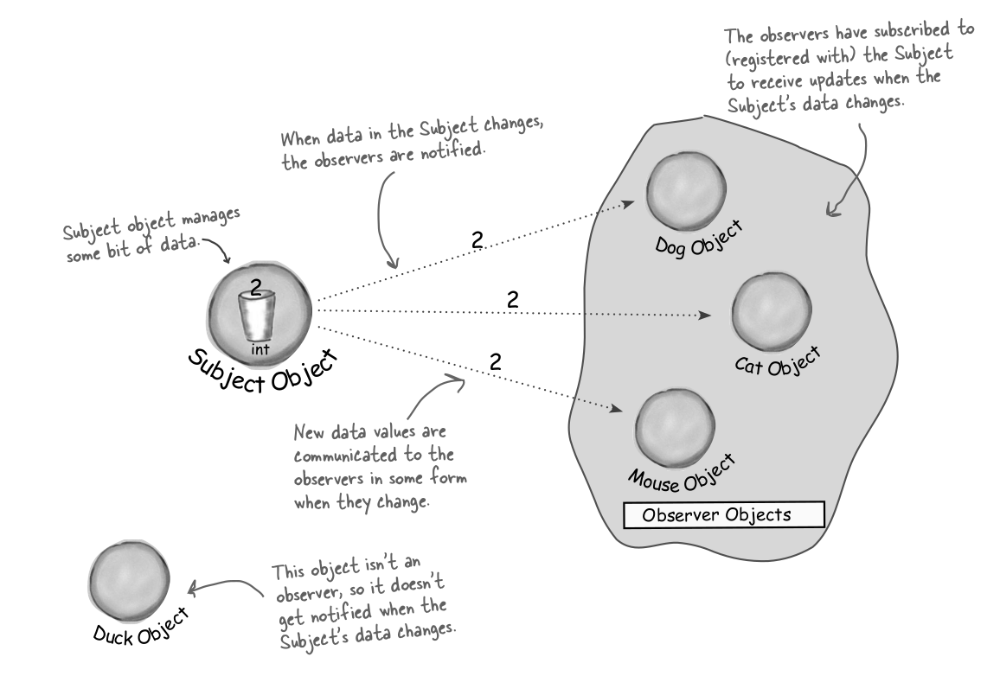
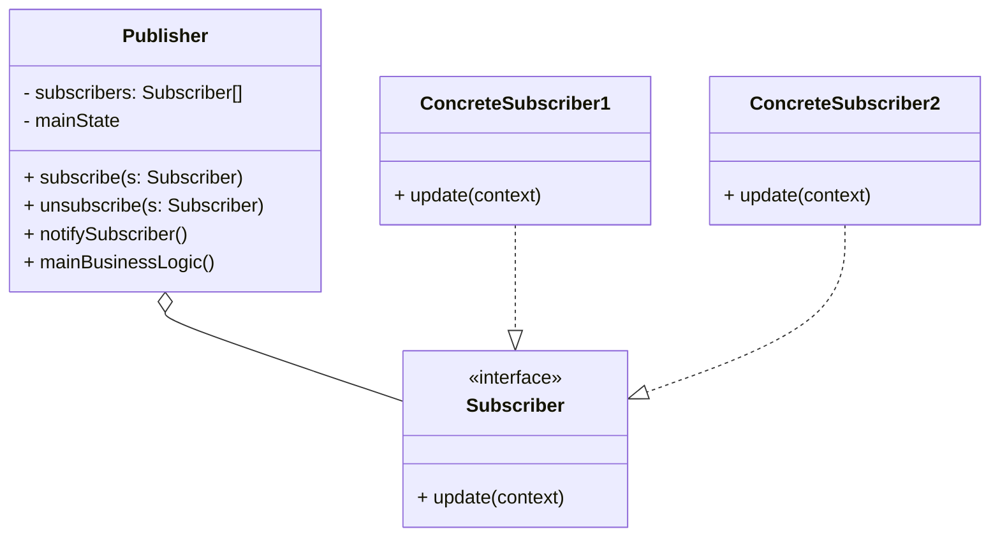
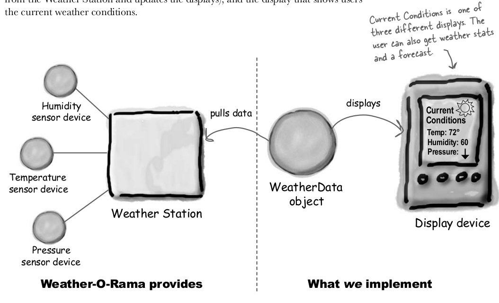
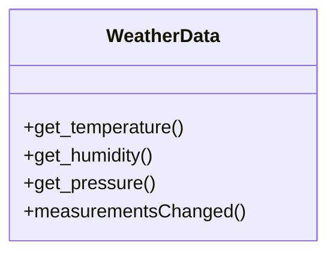
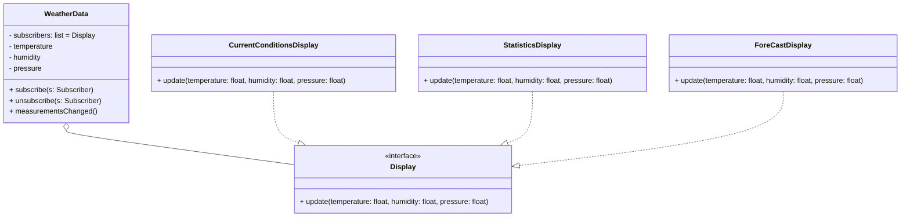

# Observer

Please, read about observer [here](https://refactoring.guru/pt-br/design-patterns/observer).

!

# Example problem: API Weather-O-Rama

This examples was extract from the book [Head First Design Patterns](https://www.oreilly.com/library/view/head-first-design/0596007124/).

> The weather station will be based on our patent pending WeatherData object, which tracks current weather conditions (temperature, humidity, and pressure). We'd like for you to create an application that initially provides three display elements: current conditions, weather statistics and a simple forecast, all updated in real time as the WeatherData object acquires the most recent measurements.

Here a scheme of the final application:

!

## What we know about the WeatherData?

- The WeatherData class has getter methods for three
measurement values: temperature, humidity and
barometric pressure.
- The measurementsChanged() method is called any
time new weather measurement data is available. (We
don’t know or care how this method is called; we just
know that it is.)
- We need to implement three display elements that
use the weather data: a current conditions display, a
statistics display and a forecast display. These displays
must be updated each time WeatherData has new
measurements.
- The system must be expandable—other developers
can create new custom display elements and users
can add or remove as many display elements as they
want to the application. Currently, we know about
only the initial three display types (current conditions,
statistics and forecast).

Here a diagram of Weather class:

Our job is to implement measurementsChanged()
so that it updates the three displays for current
conditions, weather stats, and forecast.

## API Weather-O-Rama with Observer

# Puch Line

> Strive for loosely coupled designs
between objects that interact.

